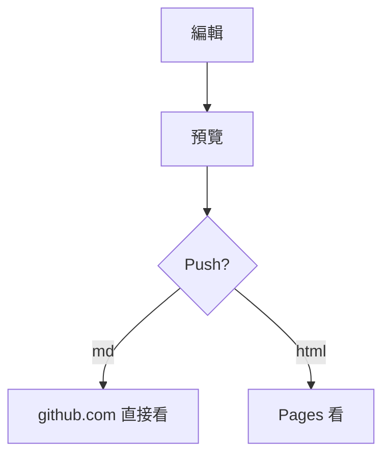

# MD-GH 全語法展示

> [!NOTE]
> 這是 GitHub Alert：NOTE / TIP / IMPORTANT / WARNING / CAUTION 都支援。

## 表格 + Task + 刪除線 + Emoji

| 功能 | 狀態 | 備註 |
|------|:----:|------|
| table | ✅ | GFM |
| mermaid | ✅ | 見下 |
| tex | ✅ | `$E=mc^2$` |

- [x] 支援 table
- [ ] 支援貼圖上傳
- [ ] 匯出 Pages

~~刪除線~~，:rocket:，自動連結 https://github.com 直接可點。

## Mermaid



## 數學 TeX

行內 $E=mc^2$，獨立：

$$
x = \frac{-b \pm \sqrt{b^2 - 4ac}}{2a}
$$

```math
\sum_{i=1}^{n} i = \frac{n(n+1)}{2}
```

## 程式碼高亮

```js
const push = async (md) => octokit.rest.repos.createOrUpdateFileContents({ md });
```

## Footnote

這裡有註腳[^1]。

[^1]: GitHub 亦支援 footnote。

## 標題錨點

跳到 [全語法展示](#md-gh-全語法展示)。
