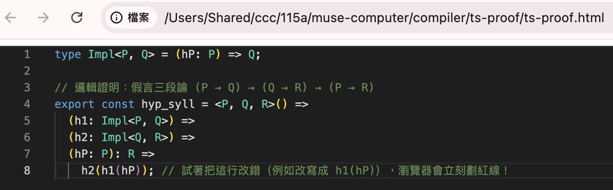
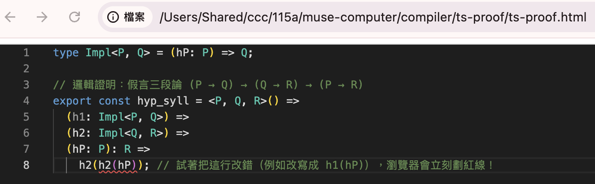

# ts-proof

柯里-霍華德對應（英語：Curry-Howard correspondence）是在電腦程式和數學證明之間的緊密聯繫；這種對應也叫做柯里-霍華德同構、公式為類型對應或命題為類型對應。這是對形式邏輯系統和數學運算之間符號的相似性的推廣。它被認為是由美國數學家哈斯凱爾·柯里和邏輯學家威廉·阿爾文·霍瓦德（William Alvin Howard）獨立發現的。

然後我就問 Gemini 能用 Pyhton 寫個邏輯推論系統嗎？

Gemini 寫了一個 ...

後來又問能用 TypeScript 寫嗎？

結果竟然不用寫，在瀏覽器中，只要引入 monaco-editor ，任何無法通過邏輯驗證的東西，自然會出現錯誤的『小蟲紅色底線』

## ts-proof.html

```html
<!DOCTYPE html>
<html>
<head>
  <script src="https://cdnjs.cloudflare.com/ajax/libs/monaco-editor/0.39.0/min/vs/loader.min.js"></script>
</head>
<body>
  <div id="container" style="width:800px;height:600px;border:1px solid #ccc"></div>

  <script>
    require.config({ paths: { 'vs': 'https://cdnjs.cloudflare.com/ajax/libs/monaco-editor/0.39.0/min/vs' }});
    require(['vs/editor/editor.main'], function() {
      // 1. 初始化 Monaco 編輯器
      const editor = monaco.editor.create(document.getElementById('container'), {
        value: [
          'type Impl<P, Q> = (hP: P) => Q;',
          '',
          '// 邏輯證明：假言三段論 (P → Q) → (Q → R) → (P → R)',
          'export const hyp_syll = <P, Q, R>() =>',
          '  (h1: Impl<P, Q>) =>',
          '  (h2: Impl<Q, R>) =>',
          '  (hP: P): R =>',
          '    h2(h1(hP)); // 試著把這行改錯（例如改寫成 h1(hP)），瀏覽器會立刻劃紅線！'
        ].join('\n'),
        language: 'typescript',
        theme: 'vs-dark'
      });
    });
  </script>
</body>
</html>
```

## 結果

正確的情況（代表證明成功）



錯誤的情況 (代表證明失敗)


